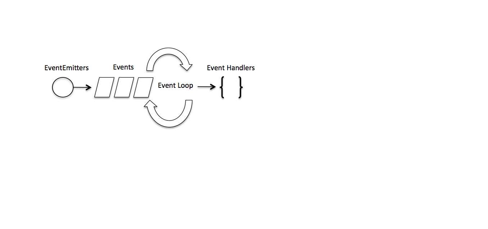

# LAB - Class 16

## Project: caps

### Author: Anolla Haddad

### Links and Resources

- [submission PR](https://github.com/401-advanced-javascript-Anolla/caps/pull/1)
- [ci/cd](https://github.com/401-advanced-javascript-Anolla/caps/runs/770776654) (GitHub Actions)
<!-- - [back-end server url](http://xyz.com) (when applicable)
- [front-end application](http://xyz.com) (when applicable) -->

### Setup

#### `.env` requirements

- `STORE_NAME` - Anolla
<!-- i.e.

- `PORT` - Port Number
- `MONGODB_URI` - URL to the running mongo instance/db --> -->

#### How to initialize/run your application

-  `npm start`

<!-- #### How to use your library (where applicable) -->

<!-- #### Tests

- `npm test` -->

#### UML

